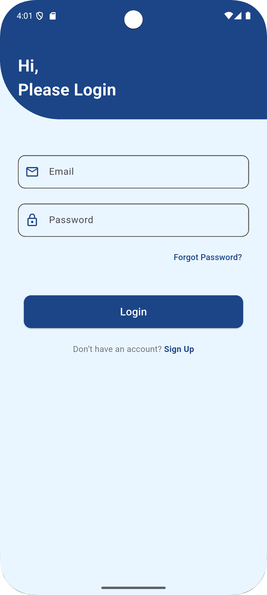
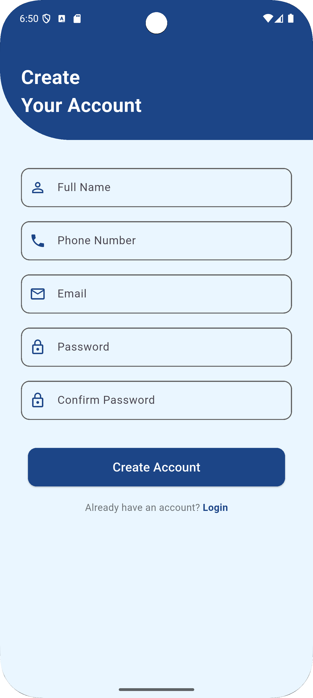
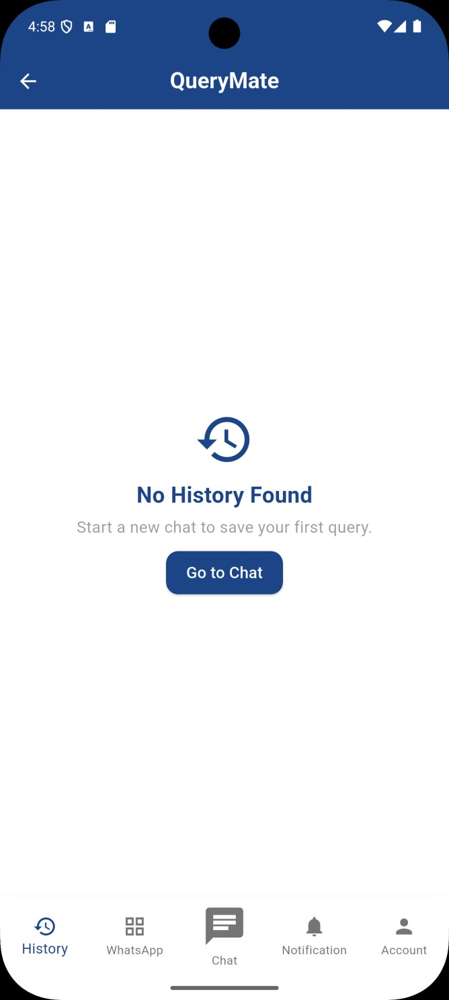
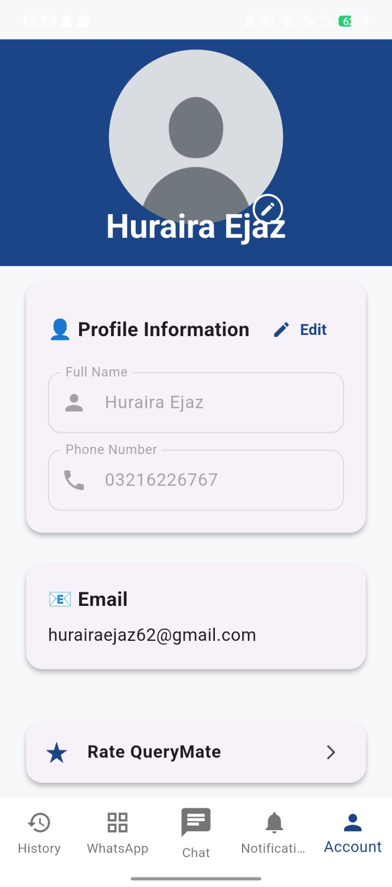
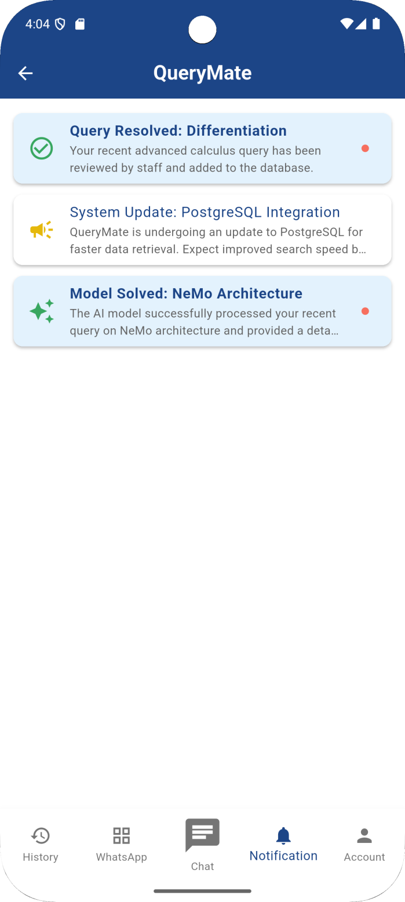
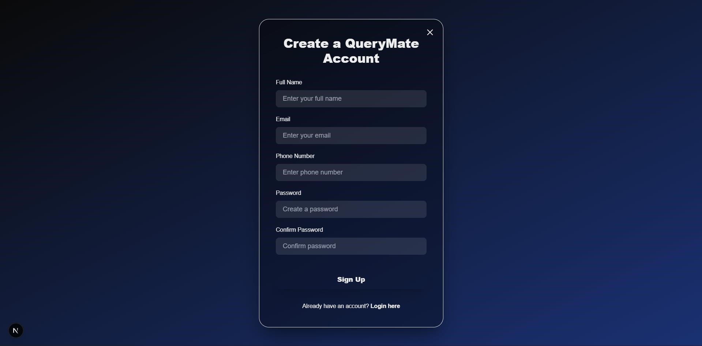

<div align="center">


# QueryMate - AI Student Query Solving System

[;Designed+for+University+Academic+and+Administrative+Support)](https://git.io/typing-svg)

</div>

---

# 📖 Project Overview

**QueryMate** is an AI-powered RAG based student query solving platform developed for the **Software Engineering Department, University of Gujrat**.

The system enables students to receive accurate answers to academic and administrative questions through an intelligent chatbot powered by * **Retrieval-Augmented Generation (RAG)**.

Students can access QueryMate through a **Flutter mobile application** or **WhatsApp**, while university staff manage the knowledge base using a modern **Next.js Admin Portal**.

---

# ✨ Features

## 🎓 Academic Support

- Course Information
- Course Outlines
- Prerequisite Guidance
- Semester Planning
- Degree Roadmap
- Academic Policies

## 🏢 Administrative Support

- Transcript Information
- Fee Refund Guidance
- Exam Rechecking Process
- Department Notices
- Office Procedures

## 🤖 AI Assistant

- Retrieval-Augmented Generation (RAG)
- Context-aware Responses
- Hallucination Reduction
- Knowledge Base Retrieval

## 📱 Student Mobile Application

- Student Login
- Query Submission
- Query History
- Notification
- Escalation Tracking
- Profile Management

## 🌐 Admin Web Portal

- Secure Authentication
- Knowledge Base Management
- Query Monitoring
- Escaled Query Solving

## 💬 WhatsApp Integration

- Student Queries via WhatsApp
- Anonymous Access
- AI Response Generation

---

# 🏗️ System Architecture

```
             +----------------------------------+
             |   Flutter Mobile App / Whatsapp  |
             +-----------+----------------------+
                             |
                             |
                 +-----------v------------+
                 |      FastAPI API       |
                 +-----------+------------+
                             |
        +--------------------+-------------------+
        |                                        |
+-------v--------+                      +--------v--------+
| |                                     | PostgreSQL DB   |
| RAG Pipeline   |                      | Knowledge Base  |
+-------+--------+                      +--------+--------+
        |                                        |
        +--------------------+-------------------+
                             |
                     +-------v-------+
                     | Next.js Admin |
                     |    Portal     |
                     +---------------+

```

---

# 🛠️ Tech Stack

## Frontend

- Flutter
- Dart
- Next.js
- React.js
- Tailwind CSS

## Backend

- FastAPI
- Python

## AI

- HuggingFaceTB/SmolLM2-1.7B-Instruct
- Retrieval-Augmented Generation (RAG)

## Database

- PostgreSQL

## APIs

- WhatsApp Business API

## Tools

- Git
- GitHub
- VS Code

---

# 📂 Project Structure

```
QueryMate
│
├── backend/
│   ├── src/
│
├── frontend/
│   ├── app/
│   ├── components/
│   ├── public/
│   └── styles/
│
├── App/
│   ├── lib/
│   ├── android/
│   ├── ios/
│   └── assets/
│
├── .gitignore
├── README.md
└── TODO.md
```

---

# 🚀 Core Modules

### 📱 Mobile Application

- Student Authentication
- Query Submission
- Query Tracking
- Notification
- Profile Management

### 🌐 Admin Portal

- Knowledge Base Management
- Student Management
- Staff Management
- Escalated Queries

### 🤖 AI Engine

- NLP Processing
- Context Retrieval
- Response Generation
- Guardrails

### 🗄️ Database

- User Management
- Query Storage
- Academic Content
- Administrative Content

---

# 🔄 Query Processing Workflow

```
Student
    │
    ▼
Flutter App / WhatsApp
    │
    ▼
FastAPI Backend
    │
    ▼
AI Enginee(RAG)
    │
    ▼
Knowledge Retrieval
    │
    ▼
AI Response Generation
    │
    ▼
Student
```

---

# 🎯 Functional Modules

- Student Authentication
- AI Chatbot
- Academic Query Handling
- Administrative Query Handling
- Knowledge Base Management
- WhatsApp Integration
- Query Escalation
- Student History
- Admin Dashboard

---

# 💡 Future Enhancements

- Voice Assistant
- Multi-language Support
- Multi-department Support
- OCR Document Understanding
- AI Analytics Dashboard
- Offline Support

---

# 👥 Team Members

| Member | Responsibility |
|---------|---------------|
| **Huraira Ejaz** | Backend Development, FastAPI, AI Enginee, PostgreSQL, Next.js / React.js |
| **Syed Ali Wali Haider Naqvi** | Flutter Mobile Application |
| **Ali Raza** | Frontend Development (Next.js / React.js) |

---

# 📸 Screenshots

## 📱 Flutter Mobile Application

### Login

<p align="center">
  
</p>

### Sign Up

<p align="center">
  
</p>

### Main Screen

<p align="center">
  
</p>

### Query Section

<p align="center">
  
</p>

### Query History

<p align="center">
  
</p>

### Profile

<p align="center">
  
</p>

### Notifications

<p align="center">
  
</p>

### Reset Password

<p align="center">
  
</p>

### Set New Password

<p align="center">
  
</p>

### WhatsApp Integration

<p align="center">
  
</p>

---

# 🌐 Admin Web Portal

### Landing Page

<p align="center">
  
</p>

### Sign Up

<p align="center">
  
</p>

### Forgot Password

<p align="center">
  
</p>

### Reset Password

<p align="center">
  
</p>

### Admin Dashboard

<p align="center">
  
</p>

### Knowledge Base Management

<p align="center">
  
</p>

### Add Data

<p align="center">
  
</p>

### Update Data

<p align="center">
  
</p>

### Delete Data

<p align="center">
  
</p>

### Escalation Queries

<p align="center">
  
</p>

# ⚙️ Installation

## Clone Repository

```bash
git clone https://github.com/hurairaejaz/QueryMate-AI-Student-Query-Solving-System.git
```

---

## Backend

```bash
cd backend

python -m venv myenv

myenv\Scripts\activate

pip install -r requirements.txt

uvicorn src.main:app --reload
```

---

## Frontend

```bash
cd frontend

npm install

npm run dev
```

---

## Flutter App

```bash
cd App

flutter pub get

flutter run
```

---

# 📄 License

This project was developed as a Final Year Project for the **Software Engineering Department, University of Gujrat**.

---

<div align="center">

## ⭐ If you like this project, don't forget to give it a Star ⭐


</div>